# Book Tracker

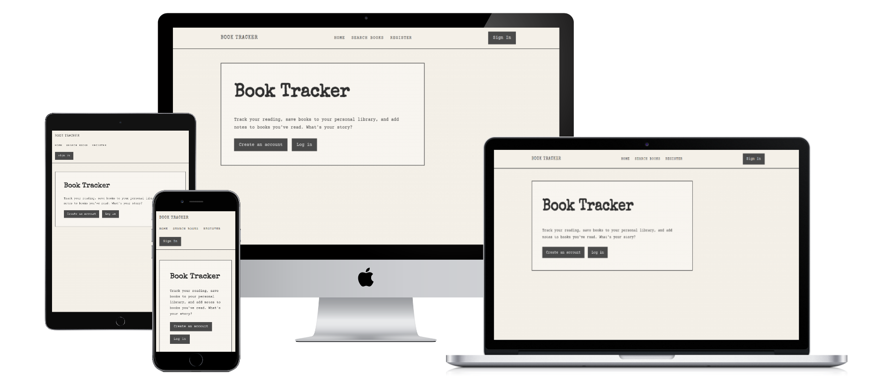

Book Tracker is a full-stack reading journal and book analysis application designed for readers, students and aspiring authors.

The application allows users to search for books using the Open Library API, save selected books to a personal library, rate them, and record structured notes. Unlike a simple reading log, Book Tracker is aimed particularly at users who want to analyse books from a writer’s perspective, including themes, structure, character arcs and personal reflections.

This project was built as a data-driven Django application using a PostgreSQL database. It includes user authentication, protected user-owned data, full CRUD functionality and deployment to a cloud platform.

## Live Site

- Live site: [Heroku Link](https://project-4-book-tracker-101a44e130e3.herokuapp.com)
- Repository: [GitHub Repository](https://github.com/gibba42/full_stack_development_project4_book_tracker)

## Technologies Used

- HTML5
- CSS
- Python
- Django
- PostgreSQL
- Open Library API
- Heroku
- Git
- GitHub
- Figma
- dbdiagram.io
- ChatGPT

## Table of Contents
  
## Project Purpose

The purpose of Book Tracker is to provide a simple, focused tool for recording and analysing books.

Many book tracking tools focus only on whether a user has read a book and what rating they gave it. Book Tracker expands on this by allowing users to record structured notes that are useful for deeper reflection, particularly for aspiring authors who want to learn from the books they read.

The application allows users to:

- Search for books using the Open Library API
- Save books to their own personal library
- Rate saved books
- Add structured notes about each book
- Edit and delete saved book records
- Manage their own data securely through an authenticated account

### Target Audience

Book Tracker is aimed at:

- Readers who want to maintain a personal reading log
- Aspiring authors who want to analyse storytelling techniques
- Students studying literature
- Casual users who want a private record of books they have read

### Project Goals

The main goals of this project are to:

- Build a database-backed Django web application
- Implement user authentication and protected user data
- Allow users to create, read, update and delete their own book records
- Integrate an external API to allow users to search for books
- Provide a clean and responsive user interface
- Use Agile planning to manage the development process
- Deploy the finished application to a cloud platform

---

## Agile Planning

### User Stories

More detailed User Stories are captured in Github issues, but at a high-level this application aims to meet the following wants:

- As a user, I want to search for books so that I can find titles easily
- As a user, I want to save books so that I can track those I have read
- As a user, I want to rate books so that I can track my opinions on them
- As a user, I want to write notes so that I can analyse books
- As a user, I want to edit or delete entries so that I can manage my data
- As a user, I want to register an account so that my data is secure

### Github Project

The Epics, User Stories, and associated tasks were captured and managed in Github Projects:

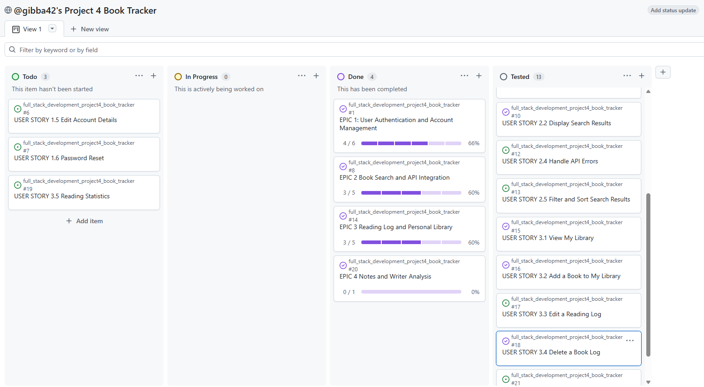

The board was used to track work through:

| Stage | Purpose |
|-------|---------|
| To Do | Work captured in the backlog but not started. |
| In Progress | Work currently in development. |
| Done | Completed work. |
| Tested | Completed work that has successfully passed tests against its acceptance criteria. |

**Note:** Epics do not progress past `Done` because their associated user stories capture their testing requirements. An Epic was considered `Done` when all associated "Must Have" user stories were tested. 

Each user story that moved out of `To Do` was further broken down into development tasks. These were tracked within the associated user stories. 

### MoSCoW Prioritisation

MoSCoW prioritisation was used to decide which features were essential for the minimum viable product and which could be deferred.

| Priority | Description |
|----------|-------------|
| Must Have | Essential features required for the application to meet its core purpose. |
| Should Have | Useful features that would improve the application but were not essential for the MVP. |
| Could Have | Desirable stretch features that could be added if time allowed. |
| Won't Have This Time | Features intentionally deferred from the final submitted version. |

---

## UX Design

### Wireframes

The wireframes for this project were developed using Figma.

Due to time constraints and for ease of development, the final pages differ slightly from the wireframes. 

 - Home page:

 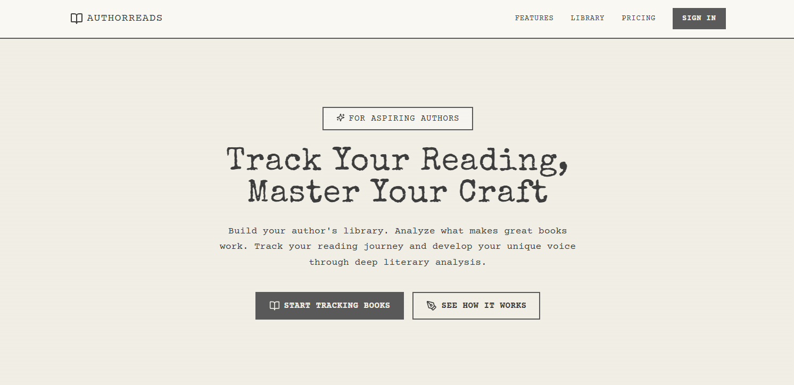

 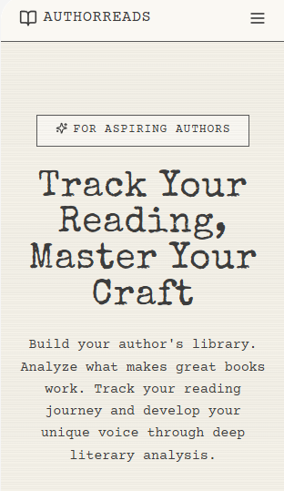

 - Create account / sign-in page:

 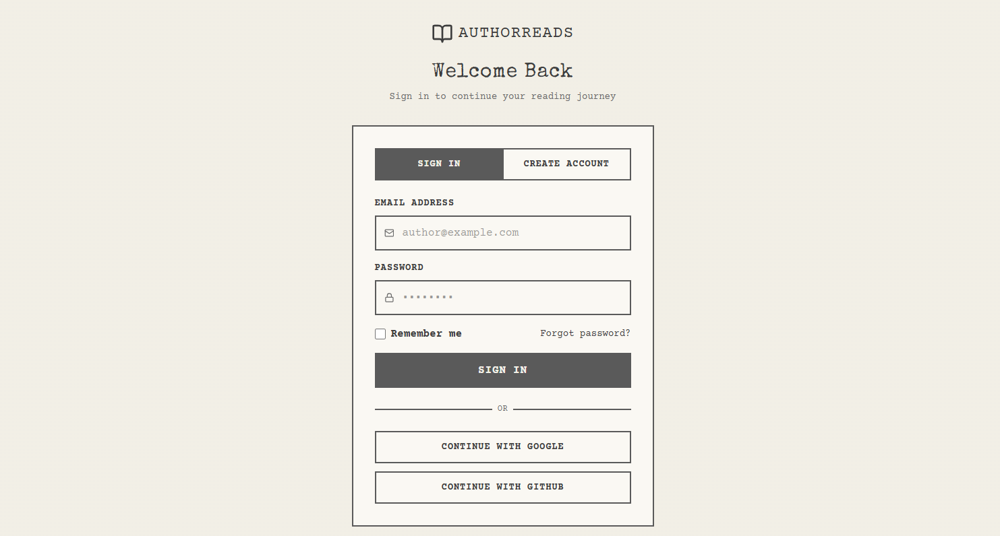

 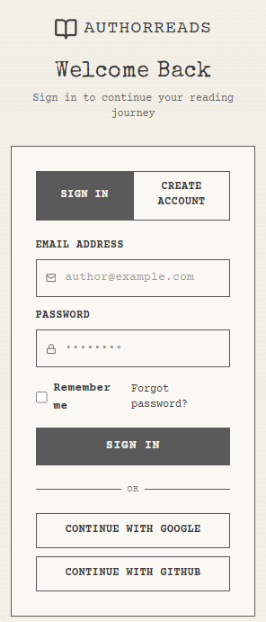

 These were split into two separate pages in development for ease.

 - My Library page:

 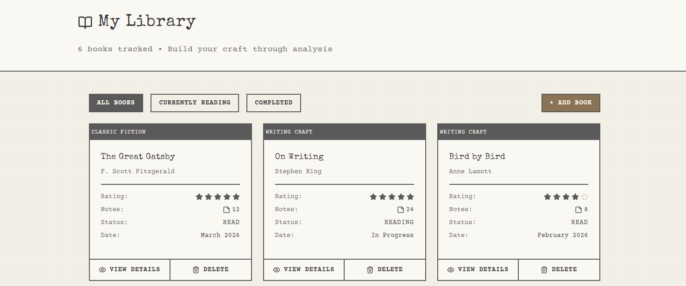

 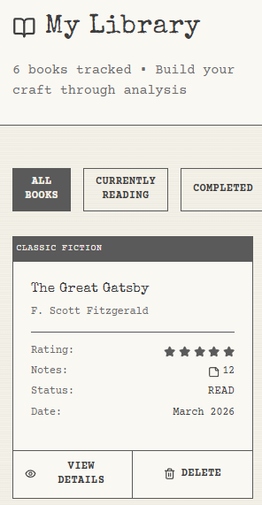

 The view was implemented as a vertical stack for ease, and to better support mobile responsiveness. 

 ---

## Features

### Home page

First time users are brought to the home page where they have the options to sign-up, or log in if they already have an account.

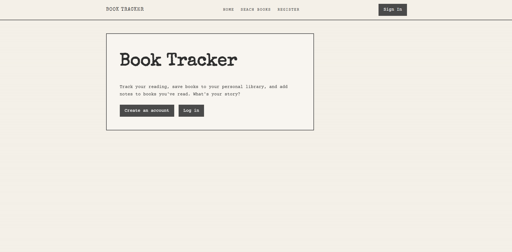

### Registration page

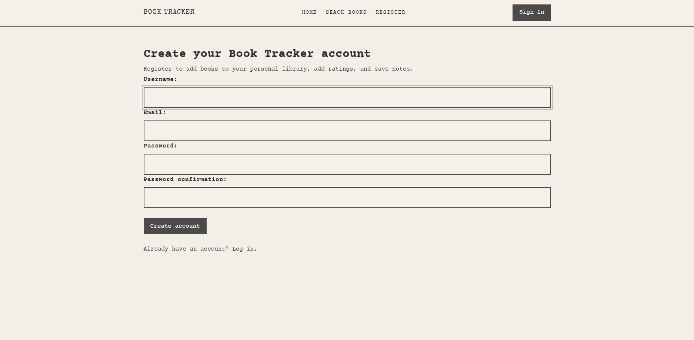

### Login page

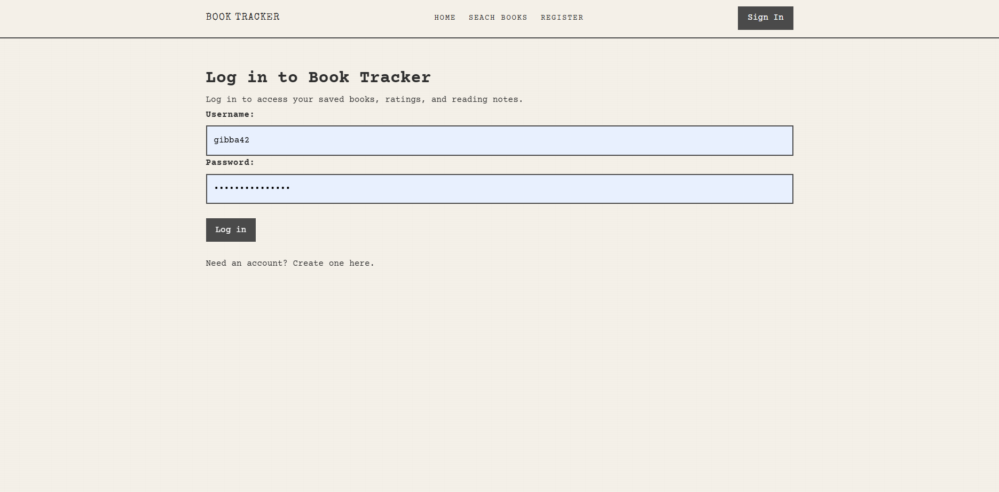

### My account page

When a user logs in, they are taken to the "My account" page. This page shows a user their user name and email. 

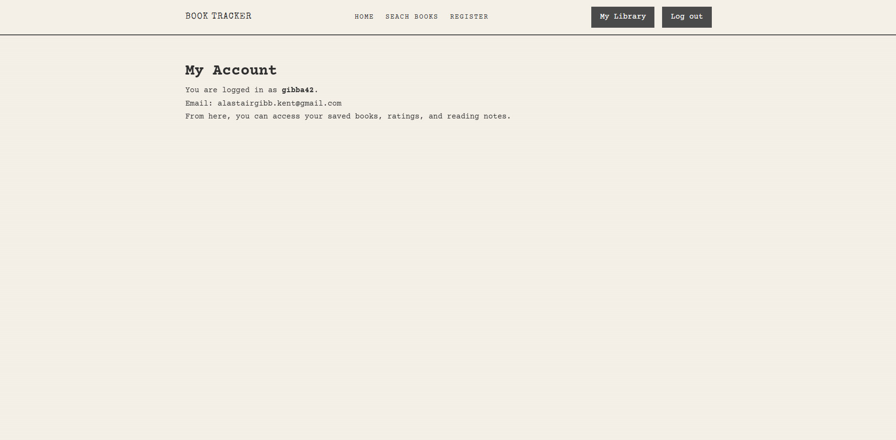

### Book search

Any user can search for a book. This feature uses the Open Library API to match search results to a comprehensive list of published books. 

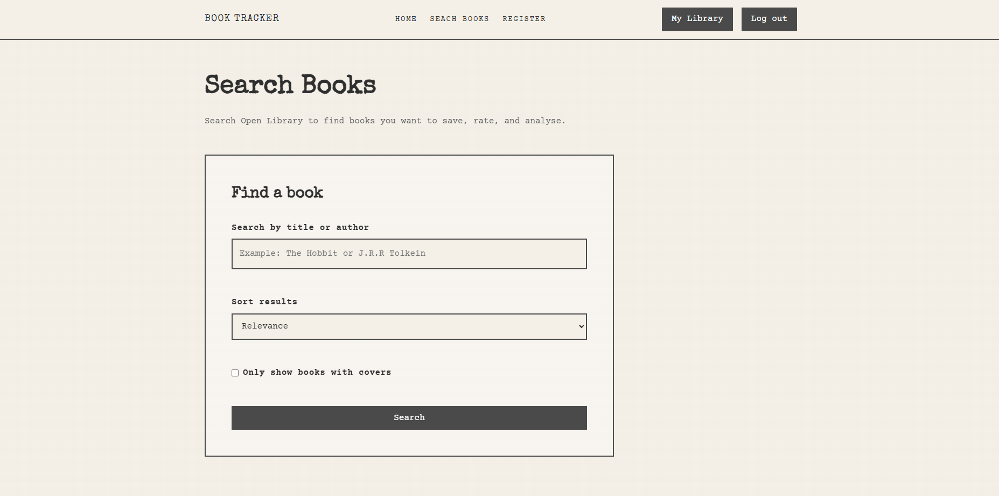

If a user is logged in, they are given the option to save books to their library:

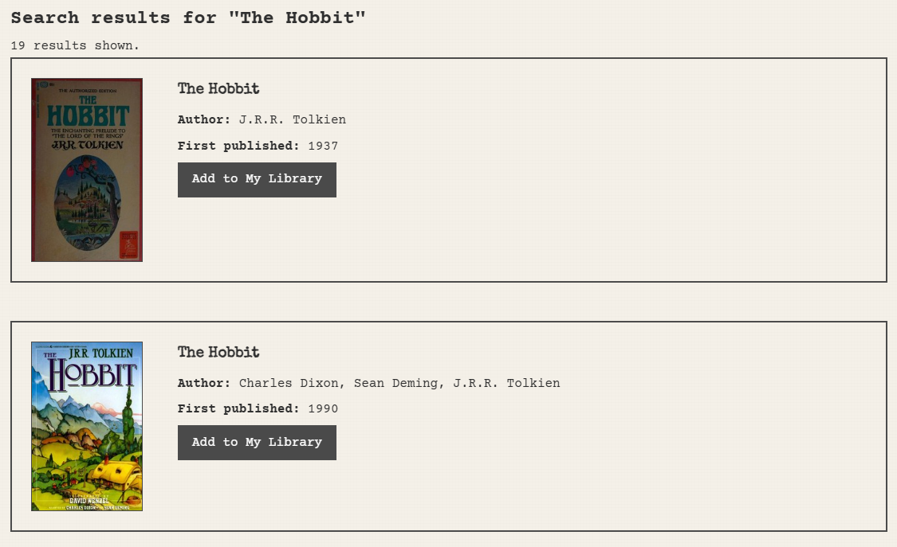

If a user is not logged in, they are shown a message saying they can log in to save books:

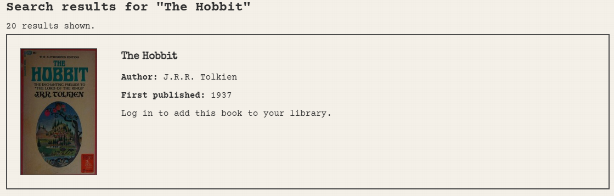

### My Library page

Saved books are shown on the My Library page:

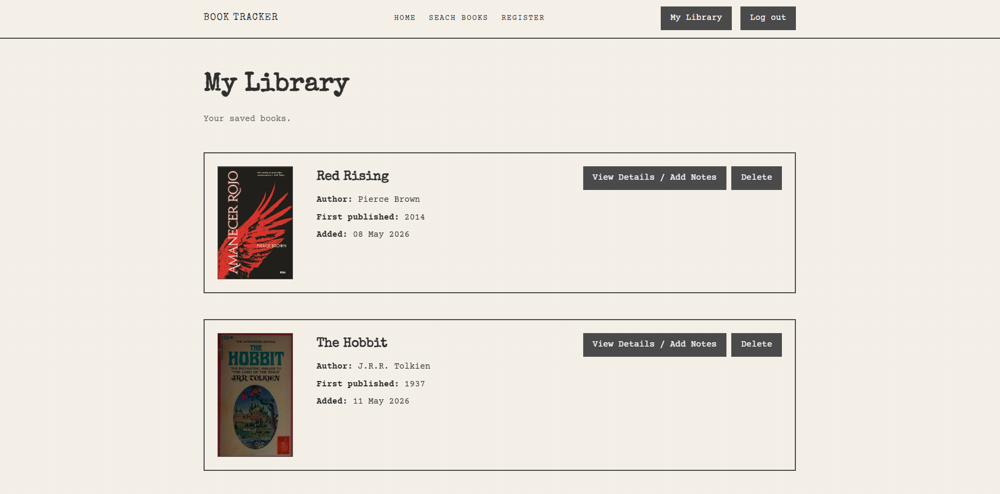

### Book details and notes

From the My Library page, users can see more details about books they have saved and add a rating:

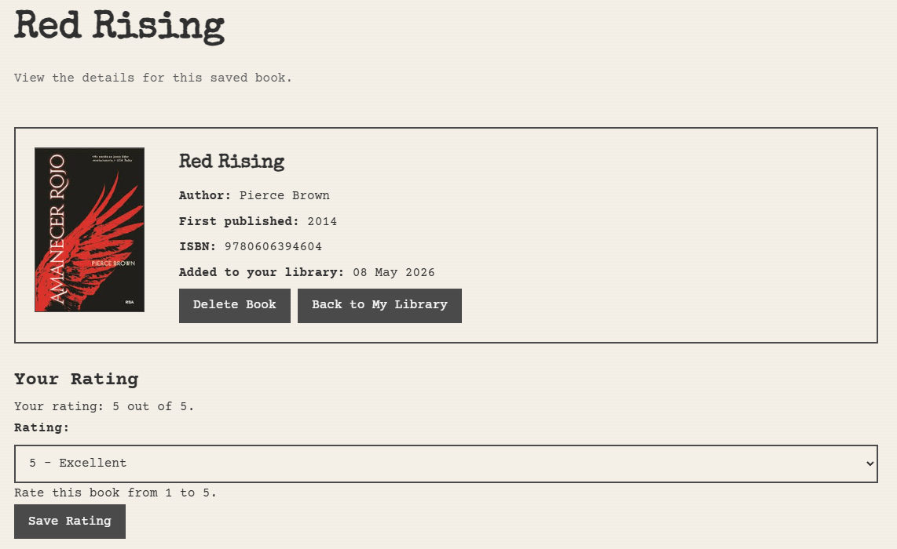

They can also add notes to books, and organise them by different categories:

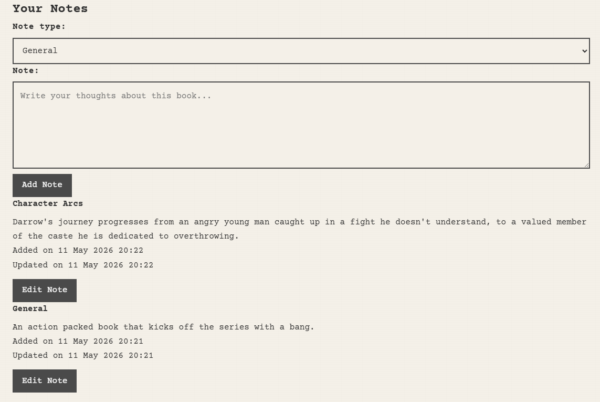

---

## Data Model

Book Tracker uses a relational database to store user-owned book records and notes. The application uses Django's built-in `User` model for authentication, with two custom models: `Book` and `BookNote`.

Each saved book belongs to one user. Each note belongs to one saved book. This creates a clear relationship between users, books and analysis notes.

### Entity Relationship Diagram

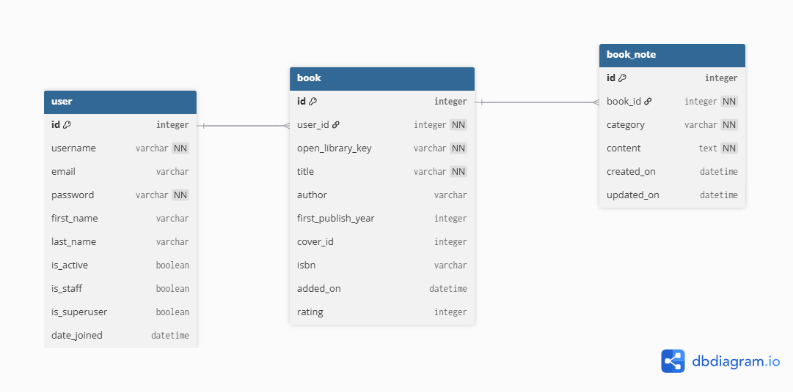

### Data Model Overview

| Model | Purpose |
|-------|---------|
| User | Django's built-in authentication model. Used to register, authenticate and identify each user. |
| Book | Stores a book saved by a user to their personal library. |
| BookNote | Stores structured notes linked to a saved book. |

### Model Relationships

| Relationship | Type | Description |
|--------------|------|-------------|
| User to Book | One-to-many | One user can save many books. Each saved book belongs to one user. |
| Book to BookNote | One-to-many | One book can have many notes. Each note belongs to one book. |

The relationship structure ensures that users can only access and manage their own saved books and notes.

---

## User Model

This project uses Django's built-in `User` model. The `User` model is provided by Django's authentication system and is used for account registration, login, logout and user ownership of saved data.

### Purpose

The `User` model is used to:

- Register new users
- Authenticate users during login
- Identify the currently logged-in user
- Link saved books to the correct user
- Restrict access to user-owned records

### Key Fields

| Field | Type | Description |
|-------|------|-------------|
| id | AutoField | Primary key for the user |
| username | CharField | Unique username used for login |
| password | CharField | Hashed password managed by Django |
| email | EmailField | User email address |
| first_name | CharField | Optional first name |
| last_name | CharField | Optional last name |
| is_active | BooleanField | Identifies whether the account is active |
| is_staff | BooleanField | Identifies whether the user can access the admin site |
| is_superuser | BooleanField | Identifies whether the user has all permissions |
| date_joined | DateTimeField | Date and time the user account was created |

---

## Book Model

The `Book` model stores books that users save to their personal library.

Each `Book` record belongs to one logged-in user. This ensures that users can build their own private reading library and cannot access another user's saved books.

### Purpose

The `Book` model is used to:

- Store books selected from the Open Library API
- Link saved books to a specific user
- Store useful book metadata, such as title, author, publication year and ISBN
- Store the user's personal rating
- Prevent the same user from saving the same Open Library book more than once

### Fields

| Field | Type | Description |
|-------|------|-------------|
| id | AutoField | Primary key for the saved book record |
| user | ForeignKey to User | Links the saved book to the logged-in user |
| open_library_key | CharField | Stores the unique Open Library key for the book |
| title | CharField | Stores the title of the book |
| author | CharField | Stores the author name or names |
| first_publish_year | IntegerField | Stores the first year the book was published, where available |
| cover_id | IntegerField | Stores the Open Library cover ID, where available |
| isbn | CharField | Stores the first returned ISBN, where available |
| added_on | DateTimeField | Automatically records when the book was added to the user's library |
| rating | PositiveSmallIntegerField | Stores the user's rating from 1 to 5 |

### Validation

The `rating` field uses Django validators to ensure that users can only enter a value between 1 and 5.

| Validator | Purpose |
|-----------|---------|
| MinValueValidator(1) | Prevents ratings below 1 |
| MaxValueValidator(5) | Prevents ratings above 5 |

### Duplicate Prevention

The `Book` model uses a uniqueness rule to prevent the same user from saving the same Open Library book more than once.

## BookNote Model

The `BookNote` model stores notes linked to a saved book.

This model supports the main purpose of the application: helping users analyse books from a reader's or writer's perspective.

### Purpose

The `BookNote` model is used to:

- Store notes against saved books
- Categorise notes by type
- Allow users to record analysis of themes, structure, character arcs and personal reflections
- Track when notes were created and updated

### Fields

| Field | Type | Description |
|-------|------|-------------|
| id | AutoField | Primary key for the note |
| book | ForeignKey to Book | Links the note to a saved book |
| category | CharField | Stores the note category selected by the user |
| content | TextField | Stores the user's note content |
| created_on | DateTimeField | Automatically records when the note was created |
| updated_on | DateTimeField | Automatically records when the note was last updated |

### Note Categories

The note category field uses predefined choices. This helps keep notes structured and supports the writer-analysis purpose of the application.

| Stored Value | Display Value | Purpose |
|--------------|---------------|---------|
| general | General | General notes about the book |
| themes | Themes | Notes about key themes and ideas |
| structure | Structure | Notes about plot, pacing and story structure |
| character_arcs | Character Arcs | Notes about character development |
| personal_reflections | Personal Reflections | Personal reactions, opinions and observations |

---

## Testing

### Manual Testing

Manual testing was completed against the user stories defined for this project. Each test was designed to check whether the implemented feature met the acceptance criteria described in the relevant GitHub issue.

| Epic | User Story | Acceptance Criteria Tested | Test Steps | Expected Result | Actual Result | Status |
|---|---|---|---|---|---|---|
| Epic 1: User Authentication and Account Management | User Story 1.1: Register account | Successful registration | 1. Navigate to the Register page. <br> 2. Enter a valid username. <br> 3. Enter a valid email address. <br> 4. Enter a valid password. <br> 5. Confirm the password. <br> 6. Submit the form. | The account is created successfully. The user is logged in and redirected to the profile/account area. A success message is displayed. | As expected. | Pass |
| Epic 1: User Authentication and Account Management | User Story 1.1: Register account | Unsuccessful or invalid registration | 1. Navigate to the Register page. <br> 2. Submit the form with missing required fields. <br> 3. Repeat using mismatched passwords. <br> 4. Repeat using an invalid email address. | The account is not created. The user remains on the registration page. Form validation errors are displayed explaining what needs to be corrected. | As expected. | Pass |
| Epic 1: User Authentication and Account Management | User Story 1.2: Login | Successful login | 1. Navigate to the Login page. <br> 2. Enter valid login credentials for an existing account. <br> 3. Submit the form. | The user is logged in successfully and redirected to the correct authenticated area. The navigation updates to show authenticated user options such as My Library and Log out. | As expected. | Pass |
| Epic 1: User Authentication and Account Management | User Story 1.2: Login | Unsuccessful login | 1. Navigate to the Login page. <br> 2. Enter an incorrect username and/or password. <br> 3. Submit the form. | The user is not logged in. An error message is displayed explaining that the login details are invalid. | As expected. | Pass |
| Epic 1: User Authentication and Account Management | User Story 1.3: Logout | Successful logout | 1. Log in as a registered user. <br> 2. Click the Log out button in the navigation bar. | The user is logged out. The navigation updates to show logged-out options. The user is redirected away from protected content. | As expected after configuring logout redirect. | Pass |
| Epic 1: User Authentication and Account Management | User Story 1.4: Restrict Access to Pages | Logged-in user can access restricted pages | 1. Log in as a registered user. <br> 2. Navigate to My Library.<br> 3. Open the detail page for a saved book. | The logged-in user can access their restricted pages and view their own saved data. | As expected. | Pass |
| Epic 1: User Authentication and Account Management | User Story 1.5: Edit Account Details | Profile update | 1. Log in as a registered user. <br> 2. Navigate to the profile/account area. <br> 3. Attempt to edit account details. | The user should be able to update profile details and see the updated details on the profile page. | This feature was not implemented in the final version. It was treated as a Should-have item and left as a future improvement. | Not Implemented |
| Epic 1: User Authentication and Account Management | User Story 1.6: Password Reset | Reset password request | 1. Navigate to the Login page. <br> 2. Look for a password reset option. <br> 3. Attempt to request a password reset. | The user should receive password reset instructions. | This feature was not implemented in the final version. It was treated as a Could-have item and left as a future improvement. | Not Implemented |
| Epic 2: Book Search and API Integration | User Story 2.1: Search for Books | Book search | 1. Navigate to the Search Books page. <br> 2. Enter a valid book title, such as "The Hobbit". <br> 3. Submit the search form. | A list of books matching the search term is displayed. | As expected. | Pass |
| Epic 2: Book Search and API Integration | User Story 2.2: Display Search Results | Search results displayed | 1. Search for a valid book title. <br> 2. Review the displayed results. | Each result displays key book information, including title and author. Where available, cover images and first publication year are also shown. | As expected. | Pass |
| Epic 2: Book Search and API Integration | User Story 2.2: Display Search Results | No matching results | 1. Navigate to the Search Books page. <br> 2. Enter a search term unlikely to return results, such as "xxxxxxxxxxxxxx". <br> 3. Submit the search form. | A clear message is displayed explaining that no books matched the search. | As expected. | Pass |
| Epic 2: Book Search and API Integration | User Story 2.3: Add Book to My Profile | Add book to My Library | 1. Log in as a registered user. <br> 2. Search for a book. <br> 3. Click Add to My Library on one of the search results. | The selected book is saved to the user's personal library. The user receives confirmation that the book was added. | As expected. | Pass |
| Epic 2: Book Search and API Integration | User Story 2.3: Add Book to My Profile | Logged-out user cannot add book | 1. Log out. <br> 2. Search for a book. <br> 3. Review the search result actions. | The user is not shown the Add to My Library button. Instead, they are prompted to log in before saving books. | As expected. | Pass |
| Epic 2: Book Search and API Integration | User Story 2.4: Handle API Errors | API request failure | 1. Simulate the Open Library API being unavailable by temporarily altering the API URL during development testing in the book_tracker/services.py file. <br> 2. Submit a book search. | An error message is shown explaining that book search is currently unavailable. | As expected. | Pass |
| Epic 2: Book Search and API Integration | User Story 2.5: Filter and Sort Search Results | Sort by author | 1. Enter a book or author that returns multiple results into the search bar, such as "Wind". <br> 2. Select the Author sort option. <br> 3. Submit the search. | The returned results are sorted alphabetically by author. | As expected. | Pass |
| Epic 2: Book Search and API Integration | User Story 2.5: Filter and Sort Search Results | Filter by cover availability | 1. Search for a book or author that returns multiple results. <br> 2. Select the option to only show books with covers. <br> 3. Submit the search. | Only results with available cover images are displayed. | As expected. | Pass |
| Epic 3: Reading Log and Personal Library | User Story 3.1: View My Library | User views saved books | 1. Log in as a registered user. <br> 2. Add at least one book to My Library. <br> 3. Navigate to My Library. | The saved book is displayed in the user's library. | As expected. | Pass |
| Epic 3: Reading Log and Personal Library | User Story 3.1: View My Library | Empty library state | 1. Log in as a user with no saved books. <br> 2. Navigate to My Library. | An empty-state message is displayed explaining that the user has not added any books yet. | As expected. | Pass |
| Epic 3: Reading Log and Personal Library | User Story 3.2: Add a Book to My Library | Book added successfully | 1. Log in as a registered user. <br> 2. Search for a book. <br> 3. Click Add to My Library. <br> 4. Navigate to My Library. | A new book record is created and appears in My Library. | As expected. | Pass |
| Epic 3: Reading Log and Personal Library | User Story 3.2: Add a Book to My Library | Duplicate book is not added | 1. Log in as a registered user. <br> 2. Add a book to My Library. <br> 3. Search for the same book again. <br> 4. Click Add to My Library again. | A duplicate record is not created. A message informs the user that the book is already in their library. | As expected. | Pass |
| Epic 3: Reading Log and Personal Library | User Story 3.3: Edit a Reading Log | Successful edit | 1. Log in as a registered user. <br> 2. Open a saved book from My Library. <br> 3. Edit the saved book details or rating. <br> 4. Submit the form. | The updated information is saved. The user receives confirmation and the updated information is shown in the interface. | As expected. | Pass |
| Epic 3: Reading Log and Personal Library | User Story 3.4: Delete a Book Log | Confirm deletion | 1. Log in as a registered user. <br> 2. Navigate to My Library. <br> 3. Open a saved book. <br> 4. Click Delete Book. | A confirmation page is displayed asking the user to confirm whether they want to delete the book. | As expected. | Pass |
| Epic 3: Reading Log and Personal Library | User Story 3.4: Delete a Book Log | Successful deletion | 1. Log in as a registered user. <br> 2. Open a saved book. <br> 3. Click Delete Book. <br> 4. Confirm deletion. | The book is removed from My Library. A success message confirms that the book was deleted. | As expected. | Pass |
| Epic 3: Reading Log and Personal Library | User Story 3.4: Delete a Book Log | Cancel deletion | 1. Log in as a registered user. <br> 2. Open a saved book. <br> 3. Click Delete Book. <br> 4. Click Cancel on the confirmation page. | The book is not deleted. The user is returned to the book detail page. | As expected. | Pass |
| Epic 3: Reading Log and Personal Library | User Story 3.5: Reading Statistics | Statistics displayed | 1. Log in as a user with saved books. <br> 2. Navigate to My Library. <br> 3. Look for reading statistics such as total books, top-rated books or rating summaries. | Reading statistics should be shown on My Library. | This feature was not implemented in the final version. It was treated as a Could-have item and left as a future improvement. | Not Implemented |
| Epic 3: Reading Log and Personal Library | User Story 3.5: Reading Statistics | No books saved | 1. Log in as a user with no saved books. <br> 2. Navigate to My Library. | An empty-state message should be displayed. | Empty-state message is displayed. Statistics were not implemented. | Not Implemented |
| Epic 4: Notes and Writer Analysis | User Story 4.2: Add Notes to a Book | Add notes | 1. Log in as a registered user. <br> 2. Add a book to My Library. <br> 3. Open the saved book detail page. <br> 4. Select a note category. <br> 5. Enter note content. <br> 6. Click Add Note. | The note is saved against the selected book under the selected category and displayed on the book detail page. | As expected. | Pass |
| Epic 4: Notes and Writer Analysis | User Story 4.2: Add Notes to a Book | Empty note | 1. Log in as a registered user. <br> 2. Open a saved book detail page. <br> 3. Select a note category. <br> 4. Leave the note content empty. <br> 5. Submit the form. | The note is not saved. A message is displayed explaining that notes require content before they can be saved. | As expected. | Pass |
| Epic 4: Notes and Writer Analysis | User Story 4.2: Add Notes to a Book | Categorised notes | 1. Log in as a registered user. <br> 2. Open a saved book detail page. <br> 3. Add notes using different categories, such as General, Themes, Structure, Character Arcs and Personal Reflections. | Notes are saved with the selected category and displayed with the correct category label. | As expected. | Pass |
| Epic 4: Notes and Writer Analysis | User Story 4.2: Add Notes to a Book | Edit existing note | 1. Log in as a registered user. <br> 2. Open a saved book with an existing note. <br> 3. Click Edit Note. <br> 4. Update the category or content. <br> 5. Save the changes. | The note is updated and the new content is displayed on the book detail page. | As expected. | Pass |
| Epic 4: Notes and Writer Analysis | User Story 4.3: Delete Notes from a Book | Cancel note deletion | 1. Log in as a registered user. <br> 2. Open a saved book with an existing note. <br> 3. Click Delete Note. <br> 4. Click Cancel. | The note is not deleted and the user is returned to the book detail page. | As expected. | Pass |
| Epic 4: Notes and Writer Analysis | User Story 4.3: Delete Notes from a Book | Successful note deletion | 1. Log in as a registered user. <br> 2. Open a saved book with an existing note. <br> 3. Click Delete Note. <br> 4. Confirm deletion. | The note is deleted. The user is returned to the book detail page and a success message is displayed. | As expected. | Pass |

## Validation

### W3C HTML Validation Results

The live Heroku site was used for this test. The test passed with no errors or warnings:

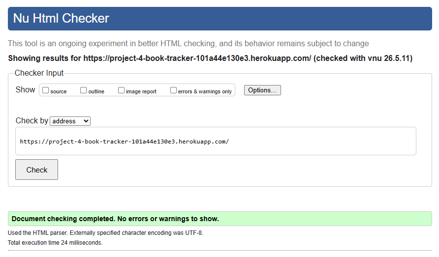

### W3C Jigsaw Validation Results

The live Heroku site was used for this test. The test passed with no errors or warnings:

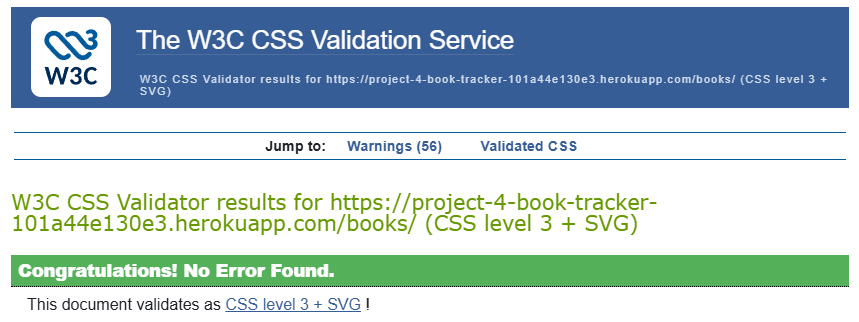

### Pycodestyle Results

The final version of the code was tested against PEP8 using the pycodestyle command:

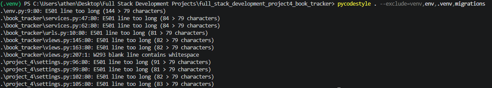

The shown flagged issues are considered acceptable. They all relate to lines being over 79 characters. In most cases they are only slightly over, or they are the default settings.py values.

### Lighthouse Results

The live Heroku site was tested using Google's Lighthouse extension. Lighthouse tests for performance, accessibility, best practices and SEO. Tests were carried out on both desktop and mobile views:

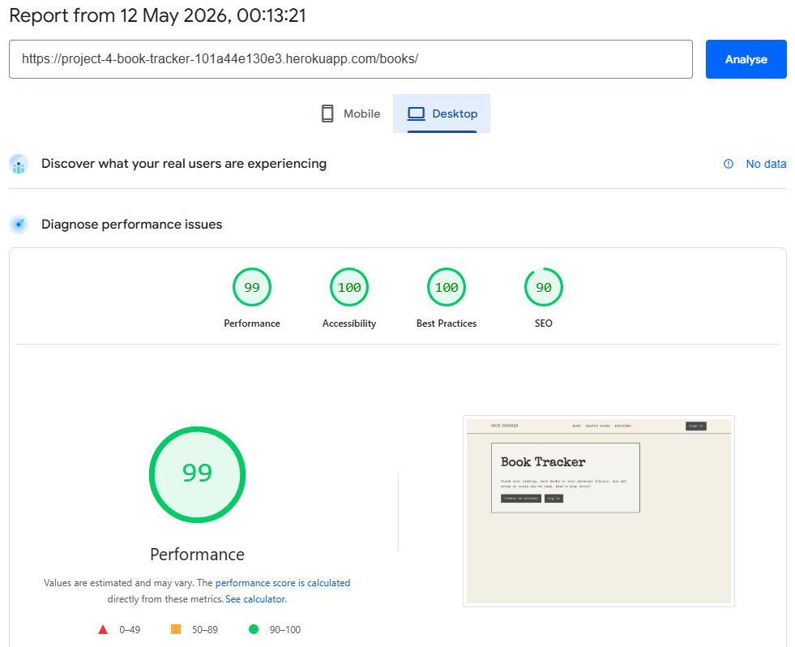

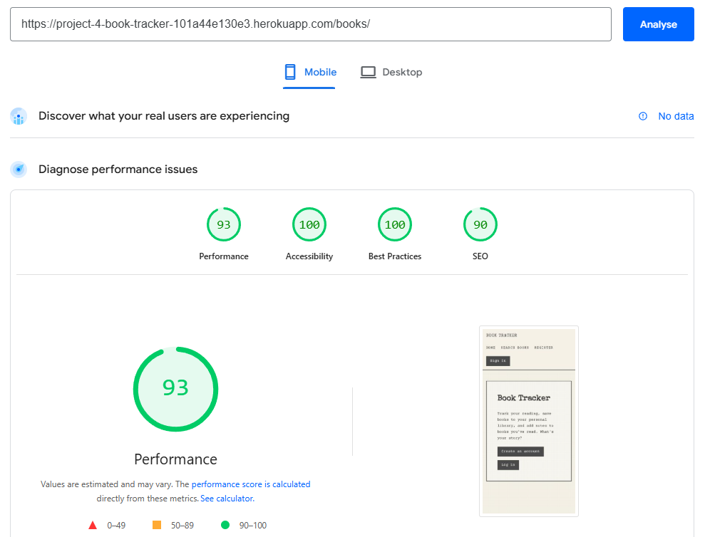

Both tests performed highly.

### Responsiveness Tests

The live Heroku site was tested for mobile responsiveness using Google development tools. The site was tested to a width of 300px, which was considered the lowest screen size a user would reasonable use:

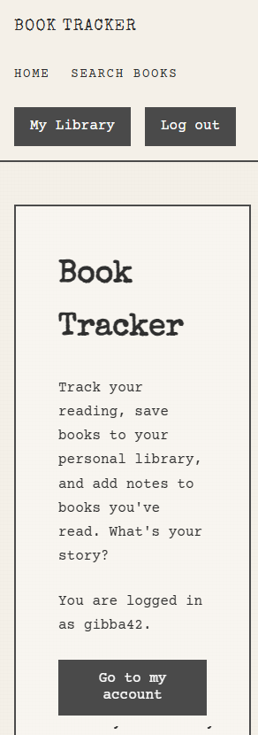

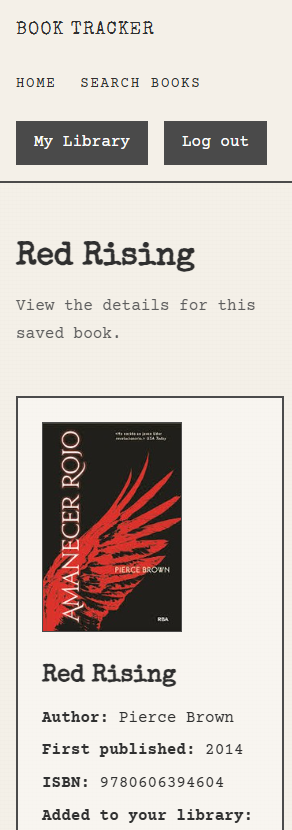

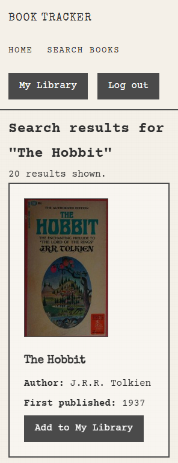

As shown above, elements scale appropriately at different resolutions.

---

## Bugs

| Title | Description | Fix | Status |
|-------|-------------|-----|--------|
| Heroku build failing | The project was not building correctly in Heroku, and was showing an "Application Error". | Updated the requirements.txt file based on the build logs to specify the latest version of gunicorn, and added a .python-version file to specify the version of python Heroku should use. | Resolved |
| manage.py runserver command failing due to Post model | The server was unable to run due to an error with the models being imported. | The error was caused by the example blog post model being leftover after the project was changed to a book model. admin.py was updated to reference the correct model. | Resolved |
| manage.py runserver command failing due to delete_book view | The server was unable to run due to the delete_book view not being indented correctly, and the get_object_or_404 shortcut not being imported. | Fixed the indentation issue so that the delete_book view is no longer nested within the edit_book view. Added the get_object_or_404 shortcut to the imports. | Resolved |
| 404 error when rating a book | When a user tries to save a book rating, a 404 error is shown. | The bug was caused by the update_book_rating form not being closed properly. Updated this section so that the form is now correctly actioning. | Resolved |
| Long notes overflowing | If a user adds a very long note, the text overflows the page and shows a horizontal scroll bar. | Updated the base css so that note cards now text wrap on overflow. | Resolved |

---

## Deployment

## Deployment

The project was deployed to Heroku using the following process.

### Local Preparation

Before deployment, the following files were checked and updated:

- `requirements.txt` was updated using `pip freeze > requirements.txt`
- `Procfile` was added with the command needed to run the application
- `DEBUG` was set to `False`
- `env.py` was added to `.gitignore`
- `SECRET_KEY` was stored as an environment variable
- `DATABASE_URL` was stored as an environment variable
- WhiteNoise was configured to serve static files in production
- `ALLOWED_HOSTS` was updated to allow the Heroku domain

### PostgreSQL Setup Steps

1. Create a new database on PostgreSQL. This project uses a database provided by Code Institute.
2. From the PostgreSQL dashboard, copy the connection URL.
3. Paste the URL into your env.py file:
   ```python
   import os
   os.environ["DATABASE_URL"] = "YOUR CONNECTION URL"
   ```

### Heroku Deployment Steps

1. Log in to Heroku.
2. Create a new Heroku app (Click `New` then `Create a new app`).
3. Add an app name. This must be unique and only have lower case letters (no spaces).
4. Select a region.
5. Click `Create App`.
6. Click on the `Settings` tab.
7. Click `Reveal Config Vars`.
8. Set your environment variables to match those in the private `env.py` file:

| Key | Value |
|-----|-------|
| DATABASE_URL | Paste the postgre connection URL |
| SECRET_KEY | A randomly generated key |

9. In your IDE, run:
```python
pip install -r requirements.txt
```
Then
```python
pip freeze > requirements.txt
```
10. Then run:
```python
echo web: gunicorn YOUR_APP_NAME.wsgi > Procfile
```
**Note:** replace YOUR_APP_NAME with the name of your Django app name

11. To connect to Heroku, run:
```python
heroku login -i
```
12. Run:
```python
heroku git:remote -a YOUR_APP_NAME
```
**Note:** replace YOUR_APP_NAME with the name of your Django app name
13. Run:
```python
git push heroku main
```

The project should now be deployed to Heroku.


---

## Security

The final deployed version of the site uses the following security features:

 - `SECRET_KEY` is not hardcoded in the repository. It is stored in `env.py` which is included in `.gitignore` so that the key is not pushed to the repository.
 - `DEBUG` is set to `False` in `settings.py`
 - User data is protected using Django's built-in authentication.
 - Sensitive pages are protected using `@login_required`

## Not Implemented / Future Features

Due to time constraints the following "Could" or "Should" features were not implemented, but should be considered if the project is further developed:

 - Edit account details. This feature was not implemented, which is why the "My account" page was not included in the nav bar. It was decided that it would be confusing for users to have access to a page with no working features. 
 - Reset password. This feature was not implemented, but would be a signficant improvement to the user experience. This would be a priority improvement. 
 - Reading statistics. These would be an interesting feature for users, but do not add significant value and as such were the last item in the backlog.

 ---

## Tutorials and guides used

### Django

This project uses the Django authentication system. This was implemented using the Django documentation:

[Using the Django authentication system](https://docs.djangoproject.com/en/6.0/topics/auth/default/)

To add css styling to the project, I followed this guide:

[How to manage static files in Django](https://docs.djangoproject.com/en/dev/howto/static-files/)

### Open Library

To allow users to search for books, this project uses the Internet Archive's Open Library API. 

[Open Library API](https://openlibrary.org/developers/api)

The book search functionality was built by referencing this documentation:

[Book Search API](https://openlibrary.org/dev/docs/api/search)

ChatGPT was used to help integrate the API with the rest of the project. 
